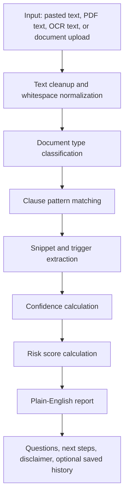

# AI/NLP Engine

Don't Sign Anything! currently uses an explainable rule-based NLP engine. It does not use a trained machine-learning model or paid LLM by default. This was an intentional MVP decision: every risk finding should be traceable to a phrase, pattern, severity rule, and plain-English explanation.

In portfolio or interview language, the analysis layer can be described as:

> An explainable NLP pipeline that classifies agreement type, detects risky clause patterns, extracts source snippets, assigns confidence, calculates risk score, and generates plain-English educational guidance.

## Why Rule-Based NLP First

Legal and agreement text is high-stakes. For an MVP, a deterministic system is easier to explain, debug, and validate than a black-box model.

This approach gives the project:

- Transparent detection rules
- Source snippets that show why a risk was flagged
- Consistent results across runs
- No required paid AI API
- A clean place to plug in an LLM later for summary improvement

The tradeoff is that the analyzer can miss clauses written in unusual wording and can flag text that is not actually risky in context. The product handles that by using careful language such as "potential risk detected" and "this is not legal advice."

## Pipeline Overview



## Core Files

| File | Responsibility |
| --- | --- |
| `backend/app/services/document_extraction.py` | Extracts text from PDFs and supported document formats. |
| `backend/app/services/ocr.py` | Converts scanned images to text when Tesseract is available. |
| `backend/app/services/document_classifier.py` | Classifies the document type using weighted keyword signals. |
| `backend/app/services/risk_analyzer.py` | Detects risk categories using regex clause rules and returns explanations, snippets, confidence, and questions. |
| `backend/app/services/scoring.py` | Converts findings into a 0-100 risk score and Low/Medium/High level. |
| `backend/app/services/summarizer.py` | Builds plain-English summaries, obligations, deadlines, parties, questions, and next steps. |

## Step 1: Text Normalization

Raw documents can contain extra spaces, line breaks, tabs, page artifacts, or OCR noise. Before analysis, text is normalized so pattern matching has a cleaner input.

Example:

```text
This Agreement   shall automatically
renew unless cancelled.
```

becomes:

```text
This Agreement shall automatically renew unless cancelled.
```

This happens through shared text helpers in `backend/app/utils/text.py`.

## Step 2: Document Type Classification

The classifier is not a neural classifier. It is a weighted signal matcher.

Each document type has a profile with signals:

- Lease agreement: `landlord`, `tenant`, `rent`, `security deposit`
- Employment agreement: `employer`, `employee`, `salary`, `at-will`
- Contractor/freelance agreement: `independent contractor`, `client`, `services`, `invoice`
- Terms of service: `terms of service`, `account`, `platform`, `continued use`
- Privacy policy: `personal information`, `cookies`, `tracking`, `third parties`
- Waiver/release form: `waiver`, `assumption of risk`, `hold harmless`
- Non-disclosure agreement: `confidential information`, `disclosing party`, `receiving party`

Each matched signal adds points. The highest scoring profile becomes the predicted document type. Confidence increases when the top score is strong and clearly ahead of the second-best type.

Output example:

```json
{
  "document_type": "Terms of service",
  "document_type_confidence": 86,
  "document_type_signals": ["terms of service", "account", "continued use"]
}
```

## Step 3: Clause Risk Detection

Risk detection uses a list of `ClauseRule` objects. Each rule contains:

- `id`
- `title`
- `category`
- `severity`
- regex `patterns`
- plain-English explanation
- questions to ask before signing

Example simplified rule:

```python
ClauseRule(
    id="auto_renewal",
    title="Auto-renewal",
    category="Renewal",
    severity="Medium",
    patterns=(
        r"\bautomatic(?:ally)? renew",
        r"\bauto[- ]renew",
        r"\brenews? (?:automatically|for successive)",
    ),
    plain_english="The agreement may keep going and keep charging you unless you act before a deadline.",
)
```

When a pattern matches, the analyzer stores:

- Trigger term, such as `automatic renewal`
- Source snippet around the matched sentence
- Risk category and severity
- Plain-English explanation
- "Why it matters" explanation
- Questions to ask
- Things to check

## Step 4: Confidence Calculation

Risk confidence is not legal certainty. It means how strong the text match is.

The current confidence formula considers:

- Number of total pattern matches
- Number of unique trigger terms
- Whether the clause fits the detected document type
- Whether the finding is high severity

High confidence means the phrase match was strong. It does not mean the clause is legally enforceable or definitely harmful.

## Step 5: Risk Scoring

The score is calculated from detected risks:

- Low severity finding: base points
- Medium severity finding: more points
- High severity finding: highest base points
- Higher-confidence findings add a small bonus
- Document type can add weight to relevant findings
- User preferences can add weight to risks the user cares about
- Multiple findings add a breadth penalty

Risk level thresholds:

| Score | Level |
| --- | --- |
| 0-34 | Low |
| 35-69 | Medium |
| 70-100 | High |

The risk score is a product signal, not a legal rating.

## Step 6: Plain-English Report Generation

The report generation is also rule-based. It creates:

- A short document summary
- Detected risky clauses
- Trigger snippets
- Obligations and deadlines
- Party/role hints
- Questions to ask before signing
- Next steps
- Legal disclaimer

The app avoids saying "this clause is illegal" or "you should sign/not sign." It says what to look at, why it may matter, and what questions to ask.

## Current Inputs And Outputs

Inputs:

- Pasted text
- Extracted PDF/document text
- OCR text from images
- Optional user preferences

Outputs:

- Document type and confidence
- Summary
- Risk score and risk level
- Detected risks
- Trigger terms and snippets
- Obligations
- Deadlines
- Parties
- Questions and next steps
- Disclaimer

## Why This Still Counts As NLP

NLP means Natural Language Processing: using software to process and understand human language. This project does that through deterministic methods instead of deep learning.

Current NLP techniques used:

- Text normalization
- Sentence splitting
- Keyword and phrase matching
- Regular expression patterns
- Document type signal scoring
- Snippet extraction
- Rule-based summarization
- Plain-English explanation mapping

Future NLP upgrades could include embeddings, semantic search, transformer classification, or LLM summarization, but those are intentionally not required for the MVP.

## Future LLM Integration

An LLM can be added later as an optional summarizer or question-answering layer. The recommended design is hybrid:

1. Keep rule-based risk detection as the source of truth for explainable findings.
2. Use an LLM only to improve summaries or answer user questions.
3. Pass detected snippets and risk metadata to the LLM instead of sending unsupported claims.
4. Keep a rule-based fallback if no API key is configured.
5. Keep "not legal advice" messaging visible.

This prevents the product from becoming a black-box legal answer generator.
