# Architecture Overview

## System Shape

Don't Sign Anything! uses a modular full-stack structure:

```text
frontend/        React + Vite web app
backend/         FastAPI REST API and analysis services
mobile/          Expo React Native app
docs/            Product, roadmap, policy, and technical documentation
notebooks/       Portfolio walkthroughs for the analysis engine
```

The web and mobile clients both call the FastAPI backend. The backend owns document extraction, OCR, classification, analysis, scoring, summarization, and saved report storage.

## High-Level Flow

```mermaid
flowchart LR
  A["User uploads, scans, or pastes text"] --> B["Frontend text preview"]
  B --> C["FastAPI extraction and analysis endpoints"]
  C --> D["Document extraction or OCR"]
  D --> E["Document classification"]
  E --> F["Rule-based risk analyzer"]
  F --> G["Scoring and summary services"]
  G --> H["Results dashboard and report export"]
  H --> I["Optional saved history"]
```



## Frontend

Location: `frontend/`

Responsibilities:

- Landing and analysis workflow
- File upload and scan upload UI
- Editable extracted text preview
- Results dashboard
- Risk score gauge and severity badges
- Expandable risk detail cards
- Source snippet highlighting
- Full report download actions
- Optional account and saved-history controls

Important folders:

```text
frontend/src/components/   Reusable UI pieces
frontend/src/pages/        Main app screens
frontend/src/services/     API client
frontend/src/utils/        Risk and report helpers
```

## Backend

Location: `backend/`

Responsibilities:

- REST API routing
- Document and image extraction
- OCR adapter
- Rule-based risk detection
- Document classification
- Risk score calculation
- Plain-English summary generation
- Local auth and saved analysis history

Important folders:

```text
backend/app/routes/        FastAPI route modules
backend/app/services/      Core product logic
backend/app/models/        Pydantic schemas
backend/app/utils/         Text helpers
backend/app_data/          Local SQLite data, ignored by git
```

## Mobile

Location: `mobile/`

Responsibilities:

- Expo React Native app shell
- Camera scan workflow
- Photo and document picker workflow
- Backend URL configuration
- Mobile analysis report
- Sign-in using existing backend endpoints
- Save, open, delete, and share reports

The mobile app is currently a development preview, not a published App Store or Google Play release.

## API Surface

Core endpoints:

- `GET /api/health`
- `POST /api/documents/extract`
- `POST /api/documents/extract-batch`
- `POST /api/documents/extract-pdf`
- `POST /api/analyze`

Account and history endpoints:

- `POST /api/auth/signup`
- `POST /api/auth/login`
- `GET /api/auth/me`
- `PUT /api/auth/preferences`
- `GET /api/history`
- `POST /api/history`
- `GET /api/history/{analysis_id}`
- `PATCH /api/history/{analysis_id}`
- `DELETE /api/history/{analysis_id}`

## Service Responsibilities

### `document_extraction.py`

Extracts text from supported uploaded document formats.

### `ocr.py`

Handles image OCR through Tesseract when the local OCR engine is installed.

### `document_classifier.py`

Classifies document types using explainable keyword and phrase signals.

### `risk_analyzer.py`

Detects risk categories using rule-based patterns and returns explanations, questions, confidence, and snippets.

### `scoring.py`

Calculates risk score and risk level based on detected findings, document type, and user preferences.

### `summarizer.py`

Creates short plain-English summaries without requiring an external AI service.

### `storage.py`

Stores users, sessions, preferences, and saved analysis reports in local SQLite.

## AI/NLP Engine

The current analyzer is an explainable rule-based NLP system. It is not a trained machine-learning model or a paid LLM integration.

The pipeline uses:

- Text normalization
- Weighted document-type keyword signals
- Regex-based clause rules
- Sentence/snippet extraction
- Confidence heuristics
- Score weighting
- Template-based plain-English explanations

This design keeps the product inspectable. If the app flags an arbitration clause, the user can see the trigger phrase and matched sentence that caused the finding.

Detailed documentation:

- [AI/NLP engine](ai_nlp_engine.md)
- [Model card](model_card.md)
- [Analyzer notebook](../notebooks/rule_based_nlp_walkthrough.ipynb)

## Data Privacy Boundaries

Uploaded source files are processed for extraction and are not intentionally stored. If a user saves an analysis, the saved report is stored locally in SQLite under `backend/app_data/`.

Sensitive data rules:

- Treat uploaded files as private.
- Avoid logging full document text.
- Do not store original uploaded files by default.
- Let users delete saved analyses.
- Keep legal disclaimers visible.

## Expandability

The architecture is designed so later phases can add:

- PostgreSQL or Supabase storage
- Production authentication
- Optional LLM summaries
- Better OCR cleanup
- Browser extension ingestion
- Mobile app publishing
- PDF report generation
- Contract comparison
- Team workspaces

## Local Development

Run backend:

```bash
cd backend
source .venv/bin/activate
uvicorn app.main:app --reload
```

Run frontend:

```bash
cd frontend
npm run dev
```

Run mobile:

```bash
cd mobile
npm start
```
